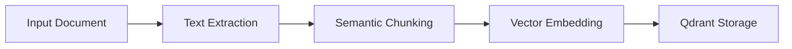
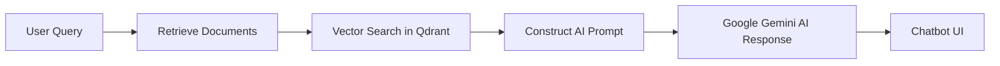
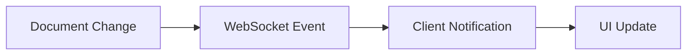
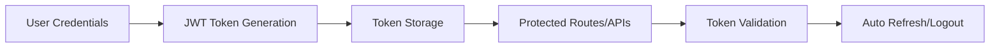

# Document Processing & AI Chatbot Service

A powerful Python service that processes documents (PDF, DOCX, TXT, HTML) and makes them searchable and interactive using AI-powered vector embeddings. Built with Qdrant for efficient vector storage and retrieval, and Google Gemini AI for intelligent response generation.

Features a simplified UI for document management and an AI agent system for complex document processing tasks.

## 🚀 Features & Benefits

### 📖 AI-Powered Document Search

- Converts documents into vector embeddings for deep search.
- Stores and retrieves context-aware information using Qdrant vector database.
- Supports PDF, DOCX, TXT, HTML, and more.

### 🤖 AI Chatbot

- Interactive Chatbot UI – Ask AI about stored business data.
- Customer-Specific Responses – Query business info, customers, and products.
- CORS-enabled API – Works seamlessly with frontend and Postman.

### 📤 Document & Folder Management

- Upload documents directly through the simplified UI.
- Create folders to organize documents.
- Name documents with custom titles during upload.
- Assign documents to specific folders.
- Delete documents and folders as needed.
- View all documents regardless of folder in the chat interface.
- Real-time updates via WebSockets when documents are added or deleted.

### 🔐 Enhanced Authentication System

- Secure JWT token-based authentication
- Strong password validation with multiple criteria
- Automatic token validation and expiration handling
- Protected routes and API endpoints
- Environment-specific configurations
- User session management and clean logout process

## 🔹 How It Works

### 1️⃣ Document Processing & Storage



- Extracts text from PDFs, DOCX, TXT, and HTML.
- Uses semantic chunking to split text into meaningful chunks with overlap.
- Embeds text using Google Gemini AI.
- Stores vectors in Qdrant for fast retrieval.

### 2️⃣ AI Chatbot Interaction



- Accepts customer-specific queries or queries across all document categories.
- Searches stored knowledge for relevant data.
- Uses Google Gemini AI to generate responses.

### 3️⃣ Real-time Updates



- Uses WebSockets for real-time communication between server and client.
- Instantly notifies clients when documents are added, updated, or deleted.
- Eliminates the need for polling, improving performance and user experience.

### 4️⃣ Authentication Flow



- Secures user sessions with JWT tokens
- Validates credentials against database
- Protects sensitive routes and API endpoints
- Handles token expiration gracefully

## ⚡ Quick Start Guides

### 1️⃣ Clone & Setup

```sh
# Clone the repository
git clone https://github.com/arashghezavati/Document-Vectorization-Service.git
cd Document-Vectorization-Service

# Create a virtual environment
python -m venv venv
source venv/bin/activate  # Linux/Mac
.\venv\Scripts\activate   # Windows

# Install dependencies
pip install -r python-services/requirements.txt
```

### 2️⃣ Configure API Keys

Create a `.env` file in the root directory with the following content:

```
GOOGLE_GEMINI_API_KEY=your_api_key_here
GEMINI_MODEL=gemini-2.0-flash
JWT_SECRET_KEY=your_jwt_secret_key
EMBEDDING_DIMENSION=768

# Qdrant Configuration
QDRANT_URL=your_qdrant_cloud_url
QDRANT_API_KEY=your_qdrant_api_key
```

### 3️⃣ Start the AI Chatbot API

Run the FastAPI backend to enable chatbot functionality:

```sh
# Make sure you're in the python-services directory
cd python-services

# Start the API server
python run_server.py
```

- Backend URL: http://localhost:8000
- API Docs: http://localhost:8000/docs

### 4️⃣ Open the Application UI

- Open `http://localhost:3000` in your browser.
- Register or log in to your account.
- Navigate through the simplified interface:
  - **Dashboard**: Overview of your documents and folders.
  - **Documents**: Create folders and upload documents.
  - **Chat**: Interact with the AI chatbot about your documents.

### 5️⃣ Working with Documents

- Create folders to organize your documents.
- Upload documents with custom names and assign them to folders.
- All documents will be available in the chat interface regardless of folder.
- Use the document filter in chat to focus on specific documents.
- Experience real-time updates when documents are added or deleted.

## 🔧 Technical Stack

- **Backend**: FastAPI, Qdrant, WebSockets
- **Frontend**: React.js
- **Authentication**: JWT-based authentication
- **Database**: Qdrant Cloud for vector storage
- **Document Processing**: PyPDF2, python-docx, BeautifulSoup, Semantic Chunking
- **AI**: Google Gemini API

## 🔍 Recent Improvements

### Migration to Qdrant
- Replaced ChromaDB with Qdrant for improved performance and scalability
- Implemented a QdrantWrapper class to maintain compatibility with existing code
- Added robust error handling for vector operations

### Semantic Chunking
- Implemented advanced semantic chunking that respects document structure
- Added chunk overlap to maintain context between chunks
- Increased chunk size from 1000 to 4000 characters for better context
- Enhanced metadata extraction for improved retrieval

### Real-time Updates with WebSockets
- Implemented WebSocket communication for instant updates
- Eliminated polling to reduce server load and improve performance
- Added real-time notifications for document and folder changes

## 🛠️ Environment Configuration

The application supports multiple environments through the configuration system:

- **Development**: Local testing with debugging enabled
- **Production**: Live deployment with optimized settings
- **Test**: For running automated tests

Set the environment using `REACT_APP_ENV` environment variable.

## 🔧 Authentication System

Our authentication implementation provides:

- **Secure Sign-Up**: With strong password requirements (uppercase, lowercase, numbers, special characters)
- **JWT-based Sessions**: Secure, stateless authentication
- **Token Management**: Automatic handling of token expiration
- **Protected Resources**: Secure access to documents and chat functionality

## 🤝 Contributing

Contributions are welcome! Please feel free to submit a Pull Request.

1. Fork the repository
2. Create your feature branch (`git checkout -b feature/amazing-feature`)
3. Commit your changes (`git commit -m 'Add some amazing feature'`)
4. Push to the branch (`git push origin feature/amazing-feature`)
5. Open a Pull Request

## 📩 Support

For support, please open an issue in the GitHub repository or contact the maintainers directly.

## 🚀 Deployment Options

The application can be deployed on various platforms:

- **Render**: Free tier available with sleep/wake cycles, or $7/month for always-on service
- **Railway**: $5/month minimum with no sleep/wake cycles
- **AWS**: More customizable but requires more configuration

For most users, Render provides the best balance of cost and performance.
